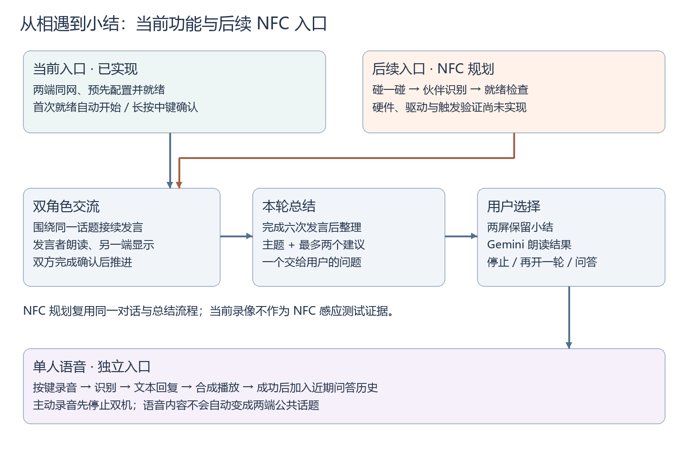
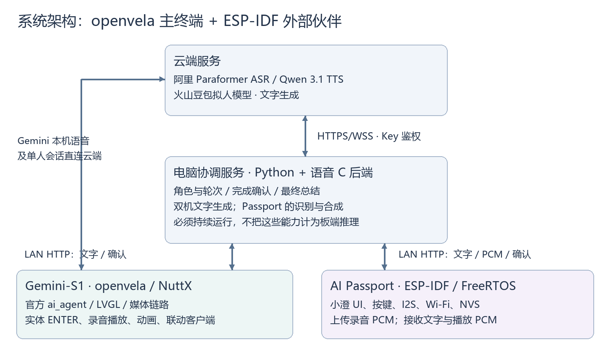
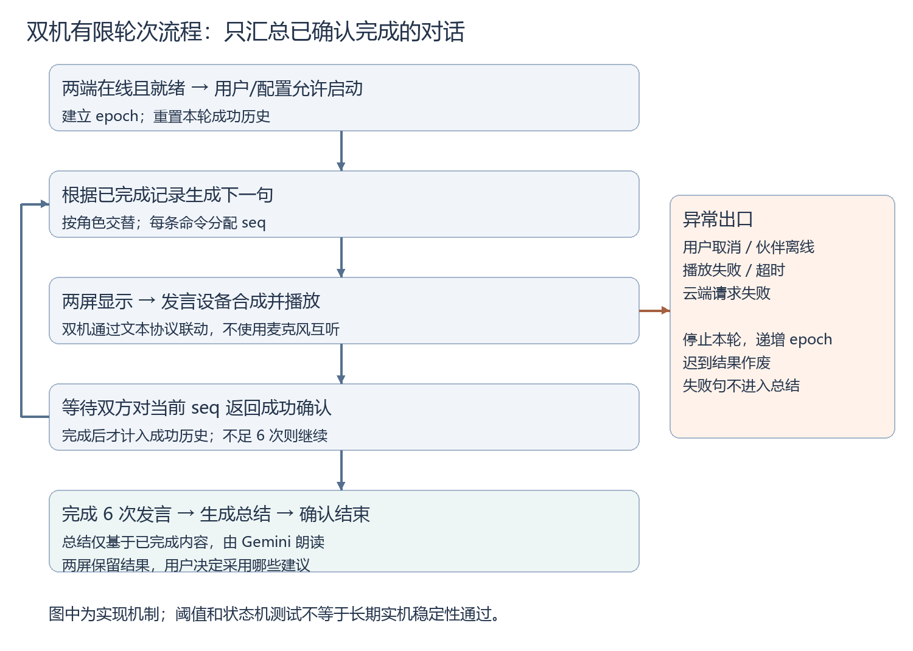

# 绮迹 · 技术报告

2026 首届 openvela AI 硬件开发者大赛｜队伍：236 无限闪耀绮迹｜2026-09-20

双角色对话 · 会话总结 · 单人语音陪伴｜后续方向：NFC 碰一碰相遇

## 1、信息表

| 项目 | 内容 |
| --- | --- |
| 作品名称 | 绮迹 |
| 队伍名称 | 无限闪耀绮迹（编号 236） |
| 团队分工 | 张熙哲：主要开发与工程实现；彭馨怡：产品规划与创意指导。 |
| 选题方向 | AI 硬件产品创新。AI Passport 作为外部协作设备，不申报新硬件 openvela 平台适配成果。 |
| 专属仓库 | https://github.com/open-vela/contest2026_236_wuxianshanyaoqiji |
| 代码提交 | PR #2 已合并；提交 c94072900d2eb4c297961d528cf7d75329d2ee43。当前报告与录像附件为随后整理的本地待确认材料。 |
| 演示视频 | 包内“演示视频/绮迹-双硬件实机演示.mp4”，235.937 秒，960×540，含音轨。使用团队提供的新版剪辑视频，打包时未再次剪辑或转码。 |

## 2、摘要

绮迹围绕“相遇、交流、总结、继续陪伴”构建双硬件角色交互。当前通过同网就绪与实体键启动，两个角色围绕同一话题轮流补充观点，完成六次发言后向用户交付小结，也支持实体键单人语音问答。产品后续计划引入 NFC“碰一碰”，把随身伙伴与桌面伙伴的接触转化为开聊入口。系统以 openvela Gemini-S1 为主终端，联动 ESP-IDF AI Passport，电脑协调轮次，云端完成识别、生成和合成。一次真实双机对话及总结用时 109.99 秒，35 项主机测试通过。当前仍依赖电脑和云服务；NFC 触发尚未实现，长期稳定性待完善。

## 3、正文

### 3.1 绪论

#### 3.1.1 背景与问题定义

用户希望在桌面屏幕上与角色交流，并让随身设备参与同一话题。2.8 寸触摸屏不适合频繁输入；实际调试中触摸操作不便，录音与回复状态不易区分。两个设备同时朗读还会造成语音重叠。本项目聚焦实体键入口、清晰的状态反馈，以及可控制的双角色轮流发言。

典型场景是用户提出“忙碌后怎样用十分钟放松”，两个伙伴各补充建议，最后形成供用户选择的小结。项目提供日常交流与建议，不判断未提供的情绪、健康状况或经历，未实现诊疗、长期记忆或用户画像。

作品的主要体验不是在两块屏幕上重复播放同一段回复，而是让两个角色拥有各自的表达方式、轮流回应对方，再把讨论结果交回用户。桌面伙伴提供固定的显示和交流入口，随身伙伴能够单独使用；当用户把它带回桌边时，两个角色进入共同话题。这样的空间动作降低了理解“双设备协作”的门槛：用户先看到两个实体伙伴相遇，再看到发言权从一个角色交给另一个角色。

| 核心功能 | 用户获得的体验 | 当前功能落点 |
| --- | --- | --- |
| 碰一碰相遇（NFC 规划） | 把随身伙伴带到桌面伙伴身边，通过接触开启共同对话 | 本版已实现就绪与按键启动的对话链路；NFC 接触检测为后续实现，见 3.2.4。 |
| 双角色交流 | 两个具有独立人设的角色，围绕同一话题接续观点 | 独立角色提示、有限轮次、两端显示、发言端播放、完成确认。 |
| 会话总结 | 不必记住全部往返，得到“聊了什么、有哪些选择、需要我确认什么” | 对已确认的发言生成小结，由 Gemini 朗读，两屏保留。 |
| 单人语音对话 | 按键说话，再按一次发送；角色用声音和文字回应 | ASR—文本模型—TTS 闭环，以及录音、识别、思考、播放状态反馈。 |

#### 3.1.2 技术难点

关键挑战是核对官方小屏配置，打通采集、识别、模型回复和媒体播放，避免耗时操作阻塞界面，并在两种系统间协调显示与播放完成。曾出现录音停止等待、音频积压、回复回调被进度消息占用及播放 EOF 处理问题，需要按阶段定位。中文显示、动画资源和音频同时运行也要求控制资源使用。

#### 3.1.3 创新与差异

产品层面将桌面和随身设备组成两个独立角色，围绕同一任务提出互补建议。交互层面采用实体键和状态驱动动画。工程层面使用“双方确认—下一句—最终总结”的有限轮次机制，以文本协议协作，避免用麦克风回录另一台扬声器。贡献是多设备交互与系统集成，不主张基础大模型算法原创或行业首创。

与单设备连续问答相比，双角色可以分别提出方案、回应取舍，再将结果压缩为一次面向用户的交接。六次发言的上限用于控制演示长度与认知负担；用户可以旁听，也可以主动停止。与同时打开两个独立聊天窗口相比，两个设备共享这一轮的已完成记录和发言顺序，用户不用手动复制上一句或分别等待两端生成。

### 3.2 系统方案设计

#### 3.2.1 总体架构

| 节点 | 运行系统 | 职责与数据 |
| --- | --- | --- |
| Gemini-S1 / R528 | openvela / NuttX | LVGL 小屏、ENTER、录音播放、官方 ai_agent 单人会话、双机文本客户端；本机语音调用云服务。 |
| AI Passport / ESP32-C3 | ESP-IDF 5.5.3 / FreeRTOS | 小澄界面、实体键、I2S 音频、Wi-Fi、NVS；上传录音 PCM，接收文字与合成 PCM。 |
| 电脑协调服务 | Python；Windows 下借助 WSL 调用语音 C 程序 | 角色、轮次、完成确认、云端文字生成、Passport 的 ASR/TTS；需持续运行。 |
| 云端 | 阿里语音、火山豆包 | 识别、文本生成、语音合成；API Key 保存在本地配置。 |

AI Passport 未运行 openvela，也未进行本项目的新 BSP 移植。共用 LVGL 或协议不代表共用操作系统。双机文字生成由电脑发起；Gemini 单人会话使用自身的官方 ai_agent 链路。

#### 3.2.2 选型、端云分工与网络策略

| 方案 | 优点 | 选择与代价 |
| --- | --- | --- |
| Gemini-S1 原生应用 | 复用官方图形、AI Agent、媒体能力 | 作为 openvela 主终端，保留 2.8 寸 SPI 配置，避免套用 7 寸屏方案。 |
| AI Passport 外部终端 | 现有 BSP、屏幕、按键与音频便于联动 | 使用 ESP-IDF；明确跨系统边界，不计作 openvela 移植。 |
| 电脑协调与云端生成 | 易于安排轮次、排障和复用语音后端 | 当前采用；增加电脑、网络与账户依赖，尚非独立产品。 |
| 两设备互听或端侧大模型 | 前者接入直观，后者可减少云依赖 | 互听易串话，改用文本；本地大模型未实现，无端侧算力或量化评测。 |

弱网或断网时不生成虚构回复。检测到离线、播放超时或云端错误后结束本轮，丢弃迟到结果，重连后由用户重新启动。text-only 模式用于通信调试，不是离线 AI 降级；demo 模式只用于明确标注的脚本预览。错误提示与冷启动网络恢复仍有不足。

#### 3.2.3 通信与协同模块

设备间通过可信局域网 HTTP 通信，默认端口 8765，以配对码鉴权；云端使用 HTTPS/WSS 与 Bearer Key。云端 Key 不下发到 Passport。每条指令含会话、序号、角色、文字和播放标志，发言端播放，另一端显示；双方确认后推进。未实现公网远程控制或设备间端到端加密。

#### 3.2.4 “碰一碰”相遇交互及触发边界

“碰一碰”是本作品计划使用 NFC 实现的相遇入口：用户把随身设备带到桌面伙伴身边，通过一个直观接触动作表达“让你们聊一会儿”。本版先完成后续的角色对话与总结链路，运行前由用户配置共同电脑服务和配对码；物理靠近本身目前不会产生启动事件。

当前代码可核验的启动入口有两种：默认服务在两端首次在线且就绪时自动开始；手动模式下长按 Passport 中键，或由电脑发送 start 请求开始。服务已经开始、设备正录音或另一端未就绪时，不重复创建新一轮。首次自动开始用过后，完成、取消或断线都不会无限自动重开。

团队已明确后续优先采用 NFC，而非把同一 Wi-Fi 上线冒充为物理接触。当前未增加 NFC 硬件、驱动或触发验收；演示可以呈现“靠近 → 实体键确认 → 两端交流”，并说明 NFC 会替代未来的启动入口。当前录像和双机计时均不作为 NFC 成功识别的证据。

| 阶段 | 用户动作与设备表现 | 协调服务的条件 |
| --- | --- | --- |
| 日常待机 | 两个角色各自待机，可分别进行单人语音 | 设备报告在线状态和是否可参与双机。 |
| 相遇准备 | 将随身设备带到桌面设备旁，确认都已联网 | 识别预先配置的两个节点，检查两端 ready。 |
| 确认开聊 | 手动模式长按 Passport 中键，或使用当前配置的启动入口 | 接受一次 start，创建新 epoch；正在交流时拒绝重复开始。 |
| 轮流发言 | 当前发言者朗读，另一端显示同一句并呈现倾听状态 | 针对当前 seq 等待两端完成确认。 |
| 小结交接 | 六次发言结束后，两屏显示总结，Gemini 朗读 | 仅使用已完成记录生成总结；总结也需要确认。 |
| 结束与重开 | 保留结果；用户决定是否再次开启 | 本轮进入 complete，下一轮重新建立记录。 |

NFC 接入的拟定处理链为“接触事件 → 识别已配置伙伴 → 检查双方就绪 → 确认/启动 → 返回状态反馈”。具体硬件、读写端布置和消息格式尚未选型，当前 BOM 不包含 NFC 模块。接入时可复用现有 start、epoch 和 seq 机制，避免重新实现对话与总结逻辑。

设计上需要处理持续贴近造成的重复事件、正在录音/发言时再次接触、对端离线和未配对设备等情况。拟采用接触去重、活动会话不重入、就绪失败提示和受控配对；NFC 仅传递识别与启动所需信息，不承载云端 Key 或完整私密对话。以上是待实现的设计约束，尚无检测距离、触发时延、成功率或安全评测数据。

#### 3.2.5 单人模式与双机模式的切换

用户的主动语音具有明确入口。Passport 短按中键进入单人录音时，会先停止双机交流，并报告自己暂不可参与双机；录音、识别或播放过程不被另一轮双机回复抢占。单人流程结束后，通过长按中键回到伙伴交流模式。Gemini 在双机进行时按 ENTER 的含义是停止本轮；空闲时该键用于开始或结束本机录音。

单人识别文字目前不会自动升级为双方的公共话题。双机话题来自服务当前配置或 start 请求，因此“说一句话就让两台设备自动讨论该话题”仍需专门的入口与确认机制。这样的划分避免把一次私下问答无提示地转发成双机共享内容。

### 3.3 核心算法与技术原理

#### 3.3.1 AI 实现与鉴权

| 能力 | 实现 | 接口与边界 |
| --- | --- | --- |
| ASR | 阿里 paraformer-realtime-v2 | 16 kHz / 16 bit / 单声道 PCM，经加密连接及 Bearer Key 接入；未训练自有模型。 |
| 文本回复 | 火山 doubao-seed-character-260628 | HTTPS Chat Completions 风格接口、Bearer Key；组合角色设定和已完成对话。 |
| TTS | 阿里 qwen-audio-3.1-tts-flash | 复用已验证的 C 语音后端，获得 PCM 后经媒体路径播放。 |
| 端侧模型 | 无本地大模型推理 | 模型框架、量化位数、端侧推理 FPS 和 NPU 占用不适用；端侧负责图形、音频和控制。 |

本版未接入 MiMo，也未使用阿里文字对话模型。Gemini 的行为卡、知识卡与来源索引编译为 3974 字节的 SOUL，限制在 4000 字节以内。这是提示词与资料注入，不是向量检索或模型微调，不保证所有输出均符合角色设定。

#### 3.3.2 调度、取消与角色动画

协调器以 epoch 标识会话、seq 标识当前指令，只接受匹配确认。两端确认成功才把本句纳入已完成对话；六次交替发言后根据这些记录生成总结，由 Gemini 朗读。取消或异常递增 epoch，使后来返回的模型结果失效。心跳超过 10 秒或伙伴未就绪会阻止新一轮开始；该数值是配置阈值，不是实测网络延迟。

动作由待机、录音、思考和说话状态驱动。Gemini 使用 16 个分层资源（12 个活动部件、4 个替换素材）与 8 张特殊动作图，以 PCM 音量驱动嘴型，文字随播放近似滚动。它不是 Live2D/Cubism 或音素级口型同步，未进行声纹或用户情绪识别。

#### 3.3.3 双角色内容生成与发言权

同一模型分别接收两个角色的设定和同一份已完成对话。琴音使用来源可追溯的角色资料，小澄使用原创角色设定；每次请求只生成当前角色的一句发言。提示词要求接住上一位伙伴的话、补充一点内容、减少重复，并控制为短口语，避免台词前缀和舞台动作被直接朗读。角色知识用于约束语气和表达，不把原作关系延伸成硬件角色之间真实存在的历史。

双机普通发言的提示目标为 30—65 个汉字，程序进一步检查非空、长度与设备字形覆盖，普通句上限为 100 个字符；长短目标属于提示约束，硬性检查的单位是程序字符数。生成后，两端收到相同文字，只有当前 speaker 的 speak 标志为真。另一端确认显示后等待，发言端确认播放完成后，服务器才交出发言权。

与按固定延时切换相比，完成确认能适应回复长度、TTS 和网络速度差异。服务端保存当前待确认指令，设备轮询遇到同一 seq 不重复排队播放；过期、重复或未来序号不能推进轮次。确认仅表示设备软件报告完成，外放是否清晰仍需用户听感或录音检查。

#### 3.3.4 会话总结：从角色交流回到用户选择

总结的作用是把“两个角色聊完了”转化为“用户能带走什么”。输入只包含用户指定话题和已经获得双方成功确认的发言，不加入未播完、播放失败、取消后返回的文字。六次发言结束后，模型收到专用总结指令，要求直接面向用户说明主题、最多两个可选建议，以及一个需要用户确认的问题。

| 总结要素 | 生成要求 | 对用户的价值 |
| --- | --- | --- |
| 讨论主题 | 概括这一轮实际谈论的事情 | 不要求用户从全部台词里重新找重点。 |
| 可选建议 | 最多两个，保留不同角色提出的主要方向 | 控制选择数量，便于比较取舍。 |
| 事实与建议 | 区分用户提供的信息与角色的提议 | 不把猜测或建议写成已经发生的事情。 |
| 待确认问题 | 把最终决定交还用户 | 不声称设备已经替用户执行行动。 |

总结提示目标为 90—160 个汉字，程序字符数上限为 180，并检查可显示字形。当前输出是自然语言文本，主题、建议数量等语义要求主要由提示词约束，尚未增加独立语义判定器。格式或字形不符合硬性检查时按请求失败处理，不能靠屏幕隐藏缺字来伪装成功。

总结作为独立指令下发：Gemini 朗读，两端都显示小结；双方确认后才置为 complete。它是本轮结果，不是长期记忆数据库。协调服务重启会清空内存中的对话与总结，尚无跨设备账号同步或历史检索承诺。

#### 3.3.5 单人语音的分阶段处理

按键录音以用户主动开始和结束为边界。音频上传后依次进入 recognizing、thinking、synthesizing、ready，避免把“已结束录音”误当作“已经拿到回复”。识别文本作为当前问题与近期成功问答一起交给文本模型，生成短口语回复，再交给 TTS。音频就绪后由设备下载并播放，成功播放才成为下一次问答的上下文。

Passport 的电脑端会话保留最近六轮成功问答，即最多十二条 user/assistant 消息；失败播放不纳入历史。每次语音请求有独立 ID、可接受状态和截止时间，取消后后续结果不能覆盖新会话。PCM 长度、偶数字节、上传分块和输出采样率均检查，避免损坏或不完整音频继续进入播放。

用户可在识别、生成或播放中取消 Passport 的当前请求，角色回到可重试状态。取消已经发往云端的操作不保证撤回云端计算，但本地会丢弃迟到结果。当前为按键式半双工问答，未实现持续监听、唤醒词或边听边说的全双工打断。

#### 3.3.6 openvela 能力运用

| 能力 | 落点 | 工程工作与改进建议 |
| --- | --- | --- |
| 图形 | Gemini 官方 LCD 后端、LVGL | 竖屏、中文浮层、实体键、分层资源；保留官方小屏硬件路径。 |
| AI | 官方 packages/ai_agent | 本地会话、角色资料和语音回调；排查进度提示占用一次性回复回调的问题。 |
| 多媒体 | 官方媒体录音播放与 PCM | 排查采集积压、停止等待、播放 EOF、格式转换和媒体策略；建立回归与日志证据。 |
| 构建复现 | 固定官方基线与准备脚本 | 核对 ROMFS 增量依赖及镜像；建议增强媒体错误向 UI 的传播、冷启动校时。 |

成果位于专属仓源码、脚本与补丁记录，不代表已合入 openvela 上游公共仓。NuttX 内核本身不作为本项目新增贡献。

### 3.4 系统实现

#### 3.4.1 软件与固件架构

Gemini 源码位于 app/gemini_chat_minimal，包含 UI、按键、语音、角色和联动客户端；录音、网络、播放在工作线程执行。Passport 源码位于 app/passport_companion/main，包含配置、UI、音频和网络；基于 FoloToy 提交 855d2106547988e33128e27aadff4fe98351fe14 与 ESP-IDF 5.5.3，保留 BSP、分区和引脚。电脑服务位于 tools/duet。

Gemini 当前累计准备入口为 tools/prepare_layered_ui.py，固定官方树与构建步骤见 docs/build-pack-guide.md；Passport 见 docs/passport-companion.zh_CN.md。仓库保存源码、资源与构建元数据，本地镜像及完整调试归档不等同全部入仓文件。

#### 3.4.2 数据流与关键流程

单人流程为按键采集、再次按键结束、ASR 返回文字、模型生成、TTS 合成和设备播放。Passport 使用 1 KB 分块 PCM 上传，录音最长 20 秒；电脑保留近期有限轮数的成功对话。这些是实现限制，不是吞吐或内存实测。双机模式直接传文字与必要音频，不开启两台麦克风互听。

从实现上分为界面、任务、会话三层。界面只负责收集按键、显示文本和角色状态；录音与播放任务独立运行并通过音频互斥量协调，防止一边换采样格式一边仍在写音频；会话层管理当前请求、历史与完成确认。电脑的协议层和云端生成层也分开，网络轮询不直接代表某句话已经完成。

Gemini 单人语音沿用本机 ai_agent 和媒体流程，双机模式复用已经打通的 UI 与语音工作线程；Passport 经电脑桥接复用 Gemini 的 C ASR/TTS 后端。这使两个终端可保持不同系统和 UI，而共享语音接入实现，减少两套后端行为不一致造成的排障成本。

#### 3.4.3 硬件与关键 BOM

| 组成 | 数量 | 接口与连接 | 适配情况 |
| --- | --- | --- | --- |
| Gemini-S1 / R528 | 1 | 原厂小屏接口、USB、Wi-Fi | 官方 BSP；未设计新 PCB。 |
| 2.8 寸 ILI9341 SPI 屏 | 1 | 原厂配套连接、竖屏 UI、触摸坐标映射 | 固定对应官方配置，不套用 MIPI 配置。 |
| AI Passport / ESP32-C3 | 1 | 既有屏幕、按键、I2S、USB、Wi-Fi | ESP-IDF 基线；未移植 openvela。 |
| USB 数据/供电线 | 2 | 分别连接设备 | 既有连接，无新增 GPIO 飞线方案。 |
| 电脑与 Wi-Fi 网络 | 各 1 套 | 局域网 HTTP、云端 HTTPS/WSS | 电脑为当前必需运行节点。 |

未完成全新硬件平台移植或新增芯片驱动；工作集中在既有硬件上的应用、配置与交互。无可复核采购价格，不申报量产 BOM 成本。未额外申报传感器或麦克风模块；采集链路是否工作和语音是否清晰分别验收。

#### 3.4.4 应用交互

Gemini 顶部显示紧凑状态和时间/版本，中间为角色，半透明文字叠在角色前，右下角为 Material 录音图标，实体 ENTER 替代触摸操作。Passport 显示小澄与文字浮层，中键用于录音或切换双机模式，上下键翻看文字。交互状态不等同云端成功，错误分类仍有待修正项。

| 交互状态 | 设备上的提示与动作 | 用户接下来能做什么 |
| --- | --- | --- |
| 空闲 | 保留角色和当前文本，显示可录音入口 | 单人说话，或让两个伙伴进入就绪状态。 |
| 录音 | 显示正在录音；录音图标变为停止语义，角色倾听 | 说完再次按键结束。 |
| 识别/思考 | 状态提示正在处理；角色切换思考动作 | 等待回复；Passport 可按键取消，避免重复发送。 |
| 单人回复 | 显示回复并播放，嘴型跟随 PCM 音量变化 | 阅读或听取内容，必要时取消 Passport 当前播放。 |
| 双机发言 | 显示当前发言者与同一句文字，另一端倾听 | 旁听；按停止入口结束本轮。 |
| 本轮小结 | 两端保留总结，Gemini 朗读 | 选择建议、翻看文本或重新开启话题。 |

长文本浮层放在角色前，避免为了完整显示回复而切换到单独文本页。Gemini 随播放近似滚动，Passport 通过上下键补充人工翻看；口型幅度反映声音强弱，不输出逐字时间戳，因此不能宣称字幕和发音精确逐字同步。实体键保留为主要操作路径，屏幕图标作为补充。

停止行为也区分“停止新轮次”和“立即静音”：Gemini 当前短句可能继续播完，Passport 在音频读写边界取消；服务端已停止派发下一句。设计上需让用户知道停止已被接受，后续将进一步统一两端的停止反馈。

#### 3.4.5 自定义 Skill 与运行时边界

已沉淀开发 Skill：skills/gemini-voice-diagnosis/SKILL.md。触发场景为“卡在开启麦克风”“录音后无回复”“第二轮异常”等，由开发智能体按固件身份、网络/时钟、采集、ASR、模型回调及播放逐层诊断，要求脱敏并区分主机、设备和听感证据。

模板要求 AI 硬件赛道说明 /data/agent/skills/ 下的运行时 Skill。目前尚无该目录中自定义运行时 Skill 的部署与触发验收记录；SOUL、知识卡和电脑轮次服务不能替代此项，因此列为未完成，不申报运行时 Skill 已上线。拟补充“休息建议”Skill：用户明确请求时触发，输出少量可选建议；这只是后续设计，不是现有功能验收。

### 3.5 系统测试与结果分析

#### 3.5.1 测试环境与口径

测试日期为 2026-09-20，使用两台实物、同一局域网、Windows 电脑及 WSL2/Ubuntu 24.04；Passport 构建使用 ESP-IDF 5.5.3。S1 排障记录中的固件身份为 Sep 20 2026 11:58:29 dd92bcf4257。云端测试需真实账户与额度；早期成功不能覆盖后续账户失败。

主机回归、合成语音输入的云接口测试、设备软件确认、用户听感与录像分别记录，不以编译成功替代设备验收，也不将配置阈值写成性能实测。

核心功能的验收单位是一次完整用户旅程：相遇并成功进入会话，交替发言，产生小结，再回到可进行单人问答或重开的状态。当前已经有一轮真实双机交流及总结的记录，但物理碰触感应、现场按键启动成功率和所有模式切换还没有形成独立量化样本，不能从该记录推导它们全部通过。

#### 3.5.2 功能测试

| 测试项 | 条件与结果 | 证据与边界 |
| --- | --- | --- |
| 双机发言与总结 | 真实设备、demo=false、语音开启；6 次发言及总结完成，两端确认 | live-round-fixed.json；单轮成功。 |
| 外放不重叠 | 用户现场反馈“没有重叠” | 主观观察，未证明音色区分或全部音质。 |
| 单人云链路 | 合成语音经真实 HTTP、ASR、豆包、TTS、音频下载成功 | voice-http-cloud-test.json；该次无实机收音、外放。 |
| S1 后续录音 | 获得 PCM，停止有返回；ASR 报 Arrearage | diagnosis.json；当前账户/额度阻断识别。 |
| 协同协议回归 | 22 项通过，覆盖鉴权、确认、取消、失败、超时和上传 | tools/duet；不是 22 轮实机测试。 |
| 日志及验收工具 | 7 项采集测试、6 项验收工具测试通过 | pr-merge-validation.json；与上项合计 35 项。 |
| 视频文件检查 | 全段解码退出 0，副本哈希一致 | 235.937 秒；内容由团队最终复核。 |

#### 3.5.3 一轮真实对话与总结的内容追踪

实测话题为“忙碌之后，怎样用十分钟、不花钱放松一下？你们各提一个可选办法，最后由主人选择。”成功记录中，琴音先提出找安静处休息，小澄提出在纸上随意画线；后续双方继续解释各自建议的准备成本和做法，最后生成面向用户的小结。它体现了接续、补充和归纳，而非两端各说一段互不相关的欢迎词。

逐句与总结原文保存在 live-round-fixed.json，可核对 speaker 顺序、内容和最终状态。现场反馈无外放重叠，软件记录两端确认成功；两类证据共同支持这一轮协作完成。它们不代表每次生成都有同样内容或相同时长，也不代表语义质量已通过大样本评测。

总结内容的复核重点是：是否与输入主题一致，是否涵盖两方实际提出的方案，是否凭空增加未聊过的事实，是否给用户保留决定空间。现阶段这些是人工复核维度；后续可建立“话题—发言—总结”的固定样本集，统计覆盖率、事实新增错误和重复建议比例，不能提前填入未经计算的分数。

#### 3.5.4 量化结果

| 指标 | 数值 | 条件及解释 |
| --- | --- | --- |
| 双机一轮总时长 | 109.99 s | 六次发言及总结，单次记录，不是平均响应时延。 |
| 单人云链路总时长 | 7.15 s | 单次合成语音至音频就绪，含识别/生成/合成，不含实物外放。 |
| S1 首批 PCM 等待 | 482 ms | 后续排障单次日志，不是识别耗时。 |
| S1 读取量 | 150,384 byte，约 4.7 s | 按 16 kHz / 16 bit / 单声道推算；不证明可懂度。 |
| S1 停止采集 | 11 ms | 同一次故障排查记录。 |
| 中文字形检查 | 20,976 个基本汉字 | 构建/渲染覆盖，不是 UI FPS。 |
| 人设文本 | 3974 byte | 编译检查，低于项目 4000 byte 上限，不是模型参数量。 |
| 功耗、峰值堆内存、UI FPS | 未测量 | 不用芯片标称参数或内存池配置代替。 |
| ASR 准确率、误报/漏报率 | 未统计 | 未建立标注语音集，样本不足以计算。 |

#### 3.5.5 可靠性、异常与兜底

已回归重复/过期确认、取消后的迟到结果、播放失败、断线和超时；失败停止本轮，不把失败发言加入成功历史与总结，实时模式不自动替换脚本。主机异常测试不能替代长时设备运行。

仍有三类问题：S1 冷启动时钟曾未设置，经 ADB 校正；ASR Arrearage 被 UI 显示为“没有识别到语音 (0)”，待修正；电脑服务曾报 can't start new thread，重启后心跳恢复，根因未闭环。连续十轮、长时运行、冷启动和完整弱网恢复仍待验收，未提供 MTBF 或可用率。

| 用户旅程中的异常 | 当前处理 | 后续应验证的指标 |
| --- | --- | --- |
| 靠近后另一台尚未就绪 | 不创建新会话，等待两端在线且 ready | 就绪等待时长、启动成功率；物理感知另行实现和测量。 |
| 对话中重复启动 | 活动状态拒绝重复 start | 多次按键是否产生重入、重复播音。 |
| 某句话显示/播放失败 | 停止本轮，失败句不进入成功历史 | 失败提示能否让用户知道是哪一端、哪个阶段。 |
| 取消后模型才返回 | epoch/语音 ID 检查丢弃迟到结果 | UI 不被旧结果覆盖，重新开始无残留播放。 |
| 总结生成失败 | 不显示虚构成功小结 | 后续可设计保留已完成文本的明确重试入口。 |
| 单人 ASR 服务不可用 | 返回错误并结束请求 | 云端错误类型应准确显示；当前 S1 提示仍需修正。 |

### 3.6 AI-Native 开发说明

| 指标 | 数据与口径 |
| --- | --- |
| AI Coding 代码占比 | 新增代码主要采用 AI 辅助开发；未做逐行归因统计，无可复核百分比。上游复用代码不计作团队 AI 生成贡献。 |
| 使用的 AI 工具 | Codex 为主要开发、排障工具；前期使用过 Trae。公开证据以已归集 Codex 记录为主，Trae 历史说明不当作完整原始日志。 |
| MCP 工具使用情况 | 可确认终端/文件、文档阅读、构建及设备调试调用；未提供 VelaJS MCP、Figma MCP 的可核验记录，不申报已使用。 |
| Skills 使用与新增 | 沉淀 gemini-voice-diagnosis 开发 Skill；Passport 开发使用本机相关开发、构建、调试 Skill。运行时部署及触发证据尚缺，见 3.4.5。 |
| Token 使用总量 | 未取得覆盖全部客户端和调用的统一统计；不由事件数推算 Token，无 MiMo 控制台用量申报。 |

AI 用于阅读官方源码、生成准备脚本与回归、分析 ADB/串口及云端日志和整理材料。以“录音后无回复”为例，需要区分采集停止、ASR 返回、进度提示占用回调及 TTS 播放，通过阶段日志与回归收敛。未做人力对照实验，不申报节省某个百分比工时。

对核心功能，AI 辅助工作的输出包括状态机代码、完成确认协议、取消/重入回归和板端日志分析。人的决策包括产品场景与角色交互选择、硬件操作、听感反馈和实际验收：张熙哲负责主要开发与工程实现，彭馨怡负责产品规划与创意指导。开发过程用“现场观察—定位阶段—修改—主机回归—实机复核”闭环约束生成结果，避免只凭生成出的代码或演示脚本判断功能完成。

仓库归集 12 个 Codex 会话、2532 事件、13 个 JSONL，官方原样校验器返回 ALL OK。保留早期 9 个文件字节，追加 766 事件，来源、时间戳、哈希与脱敏见 docs/contest/Codex兼容补采说明.md。它是手动兼容补采的部分记录，原生会话压缩缺口未恢复，不等同完整自动采集，评分接收范围待确认。按模板，日志留在仓库，不随压缩包重复提供。

### 3.7 总结与展望

#### 3.7.1 成果与贡献边界

完成了以 openvela Gemini 为主终端、ESP-IDF Passport 为配套终端的双角色语音原型，提供实体键、轻量动画、有限轮次协同和工程记录。35 项主机测试及一次真实双机完成记录支持当前成果；云服务、校时和线程问题仍保留。

工程贡献包括应用、协议、交互、准备与验证工具。小澄为原创角色；Gemini 演示角色是《学园偶像大师》藤田琴音的非官方演绎，衍生素材不声明原创、权利方授权或 Apache-2.0 许可。源码、字体/图标与角色素材的授权边界分别记录，参赛素材使用边界仍需确认。

#### 3.7.2 应用前景与商业价值

目标场景是喜欢角色互动、希望减少小屏输入的桌面与随身用户；尚无年龄、地域或市场规模调研。潜在形态包括角色桌面终端、随身配套设备与授权内容服务。商业模式仍是设想，没有收入、付费转化或量产成本证据。规模化前需合法素材、独立运行能力、云费用及网络隐私设计，并通过用户测试验证价值。

规划中的 NFC“碰一碰”提供可见的开始动作，已实现的会话总结提供结束结果，单人语音承接用户的后续问题，三者构成产品希望达到的完整陪伴流程。潜在场景可从休息建议扩展到共同讨论出行备选方案、创意发散或日常计划，但当前并无相应领域准确率验证，也不执行购物、预约等外部操作。后续用户研究应比较单角色与双角色在理解成本、建议采纳和交流负担上的差异，检验双设备价值是否超过额外硬件和等待成本。

#### 3.7.3 不足与未来工作

优先恢复识别并修正提示，完成校时和服务线程生命周期排查，再做多轮、断线恢复及资源测量。补齐运行时 Skill 实现与触发证据，随后探索减少电脑依赖。硬件多角度照片按团队本次安排暂不提交；模板对硬件作品要求该项，列入提交前待补清单。海报、答辩 PPT 留待入围阶段准备。

交互层面的后续顺序为：先让现有确认、停止和重开更稳定；再完成 NFC 硬件选型、事件接入和映射，并测量误触发、漏触发、重复接触抑制及未配对设备拒绝；随后增加用户确认的“把这句话交给两个伙伴讨论”入口。总结层面再探索保存和检索，并让用户选择哪些内容跨设备共享。上述能力均需新增实现与验收。

## 附录：复核入口与模板对照

| 评审维度 | 报告与附件入口 |
| --- | --- |
| 技术难度 | 3.2—3.5：架构、机制、实现、量化结果及源码。 |
| 产品创新性 | 摘要、3.1：实体键、桌面/随身协作与可选建议。 |
| 项目完整度 | 3.4—3.5、录像、问题清单；实物多角度照片暂缺。 |
| AI 开发 | 3.3、3.6、仓库日志与开发 Skill；运行时 Skill 和日志接收边界明确。 |
| 商业潜力 | 3.7.2：目标场景、商业设想及未验证项。 |
| 展示效果 | 包内 3 分 56 秒实机录像；海报/PPT 本轮未提供。 |

证据路径：artifacts/duet-device-20260920/live-round-fixed.json；artifacts/passport-device/20260920-voice-http-cloud-test.json；artifacts/s1-asr-recheck/diagnosis.json；artifacts/contest/pr-merge-validation.json。它们属于不同测试条件，不合并为同一次完整验收。
