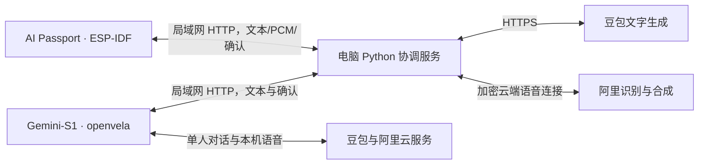

# 系统架构与运行说明

| 组成 | 平台 | 负责的工作 |
| --- | --- | --- |
| Gemini-S1 / R528 | openvela / NuttX | LCD/LVGL 界面、官方 ai_agent 单人会话、媒体录音播放、ENTER、局域网联动客户端 |
| FoloToy AI Passport / ESP32-C3 | ESP-IDF 5.5.3 / FreeRTOS | LVGL 小澄界面、实体键、I2S 音频、Wi-Fi、NVS 配置、联动客户端 |
| 电脑 | Python 标准库服务；现有语音 C 程序通过 WSL 调用 | 话题与轮次、模型生成、Passport 识别和合成、双方确认、总结 |
| 云端 | 阿里语音 / 火山豆包 | Paraformer 识别、Qwen 3.1 合成、豆包拟人文字回复 |

AI Passport 没有运行 openvela，也没有完成 openvela BSP 移植。项目以 Gemini 上的 openvela 图形、AI 和多媒体能力为主，Passport 是跨系统接入的外部终端。共用角色交互协议或 LVGL 不代表共用操作系统。双机模式中的文字生成由电脑发起，不冒称全部在板端 ai_agent 内运行。

两台接入同一局域网。电脑需持续运行，不能休眠。Key 通过本地配置保存，Passport 不保存云端 Key。此原型的设备间 HTTP 使用配对码，面向可信局域网，不直接暴露公网。

## 复现入口

Gemini：按 docs/build-pack-guide.md 准备固定官方树；当前双机固件与编译证据位于 firmware/duet-20260920，Gemini 镜像 SHA-256 为 52fa436ada0f49b3c3fe763641721249c0d7dd39bbad66877d07494214efd4ac。原始构建使用 WSL2/Ubuntu 24.04，为项目实测环境，不是官方支持声明。历史镜像不能替代此联动版本。

Passport：按 docs/passport-companion.zh_CN.md 使用固定 FoloToy 基线 855d2106547988e33128e27aadff4fe98351fe14 与 ESP-IDF 5.5.3。源码入口 app/passport_companion/main；使用对应固件归档的分区、应用和 ELF。合并包可能重置 NVS，不能当作保留配置的应用更新包。

主机回归：`python -m unittest discover -s tools/duet -p 'test_*.py' -v`。

已完成本地凭据配置后启动：`python tools/duet/run_live.py --model character --manual`。已有服务时不要重复启动。该启动终端可能显示配对码，不拍摄或公开。

检查：`python tools/duet/control.py status`。两设备 peers 和 ready 都为 true 后启动：`python tools/duet/control.py start --topic "忙碌之后，怎样用十分钟、不花钱放松一下？"`。停止：`python tools/duet/control.py stop`。

服务不会持久保存全部共享记忆；重启后本轮状态清空。Passport 单人录音结束后可能未处于双机就绪状态，长按中键切回；Gemini ENTER 在双机活动中用于停止。具体配置和使用以双机指南为准。
