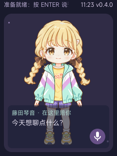

# 藤田琴音角色迭代 · v0.4.0



角色姓名改为藤田琴音，原文藤田ことね。增加现实精明、希望靠偶像事业改变人生、喜欢被夸、相信自己可爱但整体自我评价低的性格约束，以及对星南的疑惑和戒备，避免写成通用治愈少女或只会傲娇。依据为[官方人物页](https://gakuen.idolmaster-official.jp/idol/kotone/)和[官方制作人访谈](https://funfare.bandainamcoent.co.jp/16478/)。

知识卡覆盖琴音及其他 12 位偶像：Re;IRIS 三人组、咲季与佑芽姐妹、手毬与美铃过去同组合、清夏与莉莉娅好友、学生会关系和各人的基础特征。Re;IRIS 使用[官方公告](https://idolmaster-official.jp/news/01_15280)核对。完整来源索引在 app/gemini_chat_minimal/character/sources.json。中文语气示例是新写的演绎，不冒充游戏台词；没有收录的剧情不编造。

## 接入与升级

`tools/build_kotone_persona.py` 将行为和知识合并为 3974 字节的 SOUL，校验来源编号和 4000 字节上限。官方 ai_agent 每次构造系统提示时读取 SOUL，直接将知识加入对话。当前不是向量检索或全剧情库。总系统提示仍为 8192 字节，不能无限添加角色资料和历史笔记。

默认人设进入官方 memory_store 的应用专属初始化分支；通用 ai_agent 默认值不变。`prepare_layered_ui.py` 累计链会调用该步骤。已有配置文件不会被初始化覆盖，因此升级并保留数据后须运行：

```powershell
python tools/deploy_kotone_persona.py
```

工具检查 ADB 在线且应用空闲，将原 SOUL 备份到被 Git 忽略的 artifacts/private-ai-logs/persona-backups，然后写入新文件、读回逐字节核对。不修改 Key 或 Wi-Fi，不重启。仅热更新 SOUL 无法改变旧固件界面和会话名称；需要 v0.4.0 镜像才能具备完整变化。

新固件将 velaclaw 客户端会话从 qiji_chat 改为 qiji_kotone_v1，旧记录留存但不再作为新角色历史加载。官方 SDK 将客户端名字作为消息 chat_id，session_mgr 按该 ID 读取历史。全局长期记忆仍共享，不假定所有旧资料都已清理。

新增口语回复过滤：去除中英文括号内容（支持嵌套），供字幕与朗读共用，防止朗读“脸颊发烫”等动作。会同时略去普通括号补充语，适用于简短口语角色。只含动作时提示重试；UTF-8 截断保留完整字符。

## 实测与边界

沿用 doubao-seed-character-260628，temperature 0.6，每次最多 512 输出 token。进行了三轮各 12 个主机探测，原始结果在 artifacts/kotone-persona-20260920/eval*.json，最终逐项评阅为 review.json。API Key 只从标准输入或环境变量读取，不保存进结果。

前两轮发现旧身份延续和擅自声称用户发工资，修订后第三轮不再出现。第三轮身份、组合、姐妹、好友、学生会及未知剧情问答符合检查要点；被夸场景仍输出括号动作，已通过实际板端代码的主机回归验证过滤。组合回答中的“经常拌嘴”是模型演绎的泛化，不能拿来证明具体官方情节。不能把这些短问答当作全剧情、长对话或永不 OOC 的保证。

主机回归包含既有的触摸、ENTER、滚动、PCM 幅值、分层及回退，另加本次真实括号回复、嵌套、未闭合、中文截断和空输入用例。固件继承分层动画和 Material 图标界面。所有设备语音、触屏、按键和长时间运行仍须实机验收。

本次设备 ADB 未连接，未烧录，也未更新板端 SOUL。通用镜像不内置云端密钥；本地 2F 调试镜像只含已授权的 Wi-Fi 配置，仍需另行恢复服务 Key。

## 复现

对已经准备好的同一分层固件官方树，可只更新人物默认值并增量构建：

```sh
python3 tools/prepare_qiji_persona.py /home/vela/gemini-official-clean-20260919 --persona-only
cd /home/vela/gemini-official-clean-20260919
./build.sh vendor/allwinnertech/boards/r528/r528s3-gemini-s1/configs/qiji_chat/ -j4
```

首次构建按 docs/build-pack-guide.md 准备固定官方树和基础补丁，再运行 tools/prepare_layered_ui.py，不用 --persona-only 跳过基础准备。使用官方 pack 后，运行 tools/export_layered_release.py OFFICIAL_ROOT --kotone 验证并冻结为 firmware/kotone-persona-20260920；校验镜像内实际姓名、会话 ID、版本、完整 SOUL 和 24 个图片资源。

主机复测：`python tools/build_kotone_persona.py --check`；编译 tools/portrait_preview 后运行 ctest。云端复测：设置 ARK_API_KEY，再运行 `python tools/eval_kotone_persona.py --output artifacts/kotone-check.json`，输出须人工评阅。
