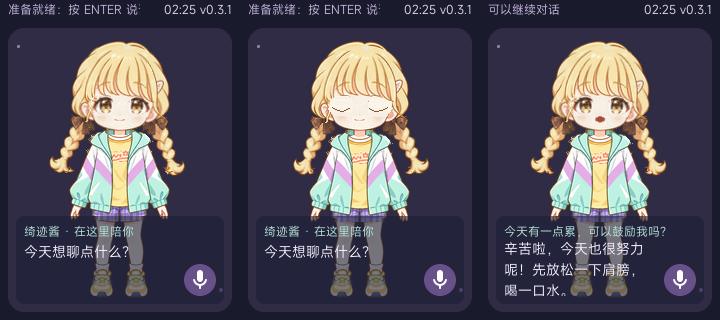

# 轻量分层角色动画

当前 240×320 LVGL 界面新增分层角色，保留 assets/kotone-v1 全部 8 张原有动作图片。日常使用 12 个活动部件，另有左右闭眼、嘴巴小开/大开共 4 个替换素材，总计 16 个 PNG 和 16 个板端二进制。



## 素材与补齐范围

2026-09-20 按用户提供的服务与密钥，通过 imagegen 技能原装 image_gen.py edit CLI 请求 https://sapi.riyuexy.cc/v1，模型列表及请求名称均为 gpt-image-2。请求 high、1024×1024，实际返回 1254×1254 RGBA，透明通道原样保留。未验证服务背后的模型实现。密钥未写入项目文件。

参考图为用户的 idol_3.png。新基础立绘保留角色与服装，改为正面、双手下垂、无遮挡面部，移除提包。完整提示词、生成图与调用记录在 output/imagegen/kotone-layered-v1。

拆分结果在 assets/kotone-layered-v1。manifest.json 记录 SHA-256、每层坐标、旋转中心和格式；layer-sheet.png 为部件总览，composite.png 为静态合成图。qiji_layer_assets.h 由拆图脚本生成。

部件：腿、左右辫子、身体、脖子、头部、左右眼、眉毛、闭口、刘海、双臂；差分：左右闭眼、小开口、大开口。双臂在此版共用一层。原有 8 张整图不覆盖、不重新生成。

补齐包括脖子桥接、刘海后的额头、眼睛/眉毛/嘴巴原位置的局部肤色或发色修复，以及内部切线 3px 重叠。外轮廓不向背景膨胀。眼睛闭合图不叠盖原睁眼，原位置已修复。这是小幅二维运动所需的局部修补，不是可供任意转头或抬臂的完整隐藏区域重绘，也不含 Cubism 网格或 PSD 模型。

## 动画与资源

- 约 3.6 秒呼吸周期，头部约 ±1.2° 摆动，倾听时额外轻倾；左右辫子、刘海使用不同延迟相位，视线轻微移动，思考时眉毛上移。
- 每约 3～5 秒眨眼，部分周期双眨；闭眼约 140ms。UI 更新间隔 50ms，板上实际帧率待测。
- 开心、安慰、惊讶整图触发后显示约 1.6 秒，自动回到分层动画；说话时优先使用分层嘴型。分层文件缺失或损坏则整体回退到原 8 图播放器；两套都不可用时回退程序绘图。
- 16 个紧边界 ARGB8888 文件共 172732 字节，完整像素缓冲约 169 KiB。旋转前一次性加载，删除角色时释放。原整图仍为 RGB565A8。当前 LVGL 文件解码器按行读取，直接旋转文件源会花屏，因此旋转层使用完整内存图片描述符。
- qiji_layers.c 仅由 UI 任务调用，不增加渲染线程。

## 音量嘴型

prepare_sprite_ui.py 将回调升级为传递播放器成功接收的 24kHz、单声道、16-bit PCM。音频线程在既有互斥锁内计算每 40ms 平均绝对幅值，使用噪声底限与限幅，不保存完整音频。4096 个环形音量槽约 4 KiB，支持任意字节分段与不足一窗的数据。

UI 根据现有播放经过时间估计值取音量，区分闭口、小开、大开。静音及播放结束立即闭口，音量下降有短暂平滑。每次朗读清空缓存，过期窗口不会误读成新语音。

音量来自真实 PCM，但播放位置仍是首批数据之后的经过时间估计，未取得硬件时间戳。网络停顿、播放器排队和扬声器延迟可能造成偏移，不能宣称音素级或严格同步。speech.gif 使用预览工具的测试音量，仅演示嘴型。

## 复现

Python 依赖：Pillow、numpy、opencv-python、scipy。已有生成原图可离线重复拆分，无需密钥：

```sh
python tools/split_layered_avatar.py output/imagegen/kotone-layered-v1/base.png
python tools/prepare_layered_ui.py /home/vela/gemini-official-clean-20260919
cd /home/vela/gemini-official-clean-20260919
./build.sh vendor/allwinnertech/boards/r528/r528s3-gemini-s1/configs/qiji_chat/ -j4
```

入口校验全部分层哈希，再执行既有累计安装链，复制到 /resource/qiji/kotone/layers。基础官方音频补丁仍按原构建指南只对干净树执行一次。

主机预览使用项目同版本 LVGL 与 MiSans 字体：

```sh
cmake -S tools/portrait_preview -B /home/vela/qiji-layered-preview \
  -DOFFICIAL_ROOT=/home/vela/gemini-official-clean-20260919
cmake --build /home/vela/qiji-layered-preview -j6
ctest --test-dir /home/vela/qiji-layered-preview --output-on-failure
```

## 验证边界

板端编译、打包与官方镜像完整性校验已完成，逐一确认 16 个分层资源和原 8 张整图进入 res.fex。独立归档为 [layered-ui-20260920](../firmware/layered-ui-20260920/README.md)，镜像 qiji-chat-layered.img，28795904 字节，SHA-256 为 `591a6ffea51255312ff50bde39339eb78ec9cc819a44be309f48ddd7822659c1`。归档包含源码、素材、提示词、ELF、配置、日志和哈希，没有覆盖旧版固件。

主机测试通过触摸坐标、ENTER 按键、正文滚动、PCM 幅值/静音/分段/环形边界/重置，以及实际 LVGL 对象的眨眼、三档嘴型、特殊动作返回、tick 回绕和缺素材回退。已查看实际渲染图与多帧预览，修复旋转时文件解码不完整造成的花屏。

尚未烧录本次分层实现；SPI 帧率、内存峰值、长时间运行、扬声器与嘴型配合需要实机验收。素材属于指定现有角色的衍生图，继承 app/gemini_chat_minimal/ARTWORK.md 的来源边界。
