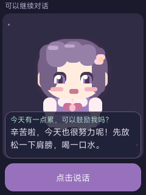

# 240×320 竖屏界面

适用于 Gemini-S1（R528）+ 2.8 寸 ILI9341 SPI 小屏。继承录音空闲积压修复及绮迹原创人设。

## 界面

- 顶部一行固定 20px，MiSans 12px；当前状态与 Wi-Fi 状态每 4 秒轮播。状态变化立即显示，长提示横向滚动。
- 中央原创 Q 版少女按 1.75 倍几何尺寸绘制，保留眨眼和呼吸，不使用额外旋转帧缓冲。
- 对话层叠在形象前景下部，半透明背景；顶部显示用户问题，正文 MiSans 14px。每 7 秒自动换到下一页，读完循环，避免触屏滑动。小字号字体加载失败时回退内置 16px 字体。
- 底部 224×46px 语音按钮；录音时显示“结束录音”，处理时显示“请稍候…”。没有手动输入框。



这张图是主机渲染预览，不是真机照片。

## 方向与触摸

通过官方 `nuttx/drivers/lcd/ili9341.c` 的 `CONFIG_LCD_PORTRAIT`、`CONFIG_LCD_ILI9341_IFACE0_PORTRAIT` 设置 240×320 硬件方向；继续使用 `/dev/lcd0`。未启用 LVGL 软件旋转，因为本树 NuttX LCD flush 没有对应像素旋转实现。

官方 `vendor/allwinnertech/chips/r528/drv/tpadc/drv_tpadc.c` 原先把屏幕设为 320×240。新增条件分支配合 ILI9341 的 MADCTL：横屏 `MV` 到竖屏 `MX`，相对坐标为 `(239 - 横屏Y, 横屏X)`。竖屏使用原始 ADC X 对应屏幕 X、ADC Y 对应屏幕 Y，并保留各自校准参数。转换前后夹紧边界，防止小于校准最小值时无符号溢出。横屏分支保持原实现。

`tools/portrait_touch.h` 由准备脚本复制到官方驱动目录，随源码一起归档；只应用 `vendor.patch` 会缺少这个新头文件，复现应使用准备脚本。

## 构建与主机检查

在固定官方源码及已应用一次的基础音频补丁上执行：

```sh
python3 /path/to/project/tools/prepare_portrait.py "$PWD"
./build.sh vendor/allwinnertech/boards/r528/r528s3-gemini-s1/configs/qiji_chat/ -j4
source build/envsetup.sh
cd vendor/allwinnertech/lichee
source envsetup.sh
lunch_nuttx r528s3-gemini-s1
pack
```

不要再运行旧准备入口覆盖最终竖屏配置。完整镜像仍须通过 `verify_official_image.py`，打包使用原官方启动组件和分区布局。

实际 UI 预览和触摸测试：

```sh
cmake -S /path/to/project/tools/portrait_preview -B /tmp/qiji-portrait-preview \
  -DOFFICIAL_ROOT=/path/to/official
cmake --build /tmp/qiji-portrait-preview -j4
ctest --test-dir /tmp/qiji-portrait-preview --output-on-failure
/tmp/qiji-portrait-preview/portrait_preview /tmp/reply.ppm \
  /path/to/official/vendor/allwinnertech/lichee/board/common/data/res/fonts/MiSans-Normal.ttf 3
```

使用同一份 `qiji_view.c`、`qiji_avatar.c`、官方 LVGL/FreeType 和 MiSans 字体。触摸测试覆盖四角、完整 uint16 ADC 范围的夹紧和单调性、不同轴校准、无效校准，不替代实物点击验收。

## 烧录与验收

通用包 `qiji-chat-portrait.img` 不含网络密码或云端 Key。本地 `qiji-chat-portrait-2f-debug.img` 预置此前授权的调试网络，不含云端 Key；该包仅本地使用。保留原横屏候选归档。

当前竖屏版完成主机构建与预览后，仍须烧录确认：屏幕方向正确；底部按钮的中心和两端均能点击；录音能停止；长回复翻页完整；Wi-Fi 状态正确；连续三轮语音及扬声器听感。主机检查通过不能视作上述真机验收通过。

烧录后关闭 PhoenixSuit；若清除了用户数据，使用 `tools/restore_board_config.ps1` 恢复 Wi-Fi / Key，已联网则加 `-KeepWifi`。
