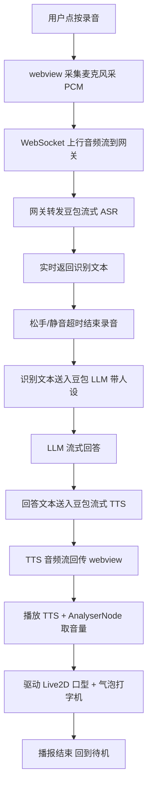

# PRD — R528 Gemini-S1 板端 Live2D 二次元语音对话界面

## 1. 产品概述

面向 openvela AI 硬件大赛的板端二次元语音陪伴 demo。在润芯微 Gemini-S1（全志 R528）开发板的板端 webview 中，以 2.8" SPI 竖屏（320×480）呈现 Live2D 二次元角色，通过板载麦克风与豆包（Doubao）云端的 STT/LLM/TTS 串联，实现「听懂—思考—开口—口型同步」的实时对话体验。

- 主要目的：验证 openvela 板端 webview + Live2D + 云端大模型语音对话的完整链路，作为大赛参赛作品的核心交互界面。
- 目标用户：openvela 大赛评委 / 二次元语音陪伴场景的创客原型。
- 市场价值：为 R528 这类轻量 IoT 平台跑通「二次元 AI 陪伴」产品形态提供可复用模板。

## 2. 核心功能

### 2.1 用户角色

无角色区分，单一使用者（板端操作者）。

### 2.2 功能模块

1. **主对话页**：Live2D 角色舞台、对话气泡、录音/播放控制、状态指示。
2. **设置抽屉**：音量、角色（Hiyori/Haru 切换）、TTS 音色、唤醒灵敏度、API 配置入口。

### 2.3 页面详情

| 页面名称 | 模块名称 | 功能描述 |
|-----------|-------------|---------------------|
| 主对话页 | Live2D 舞台 | 居中渲染 Hiyori 模型，待机呼吸/眨眼/随机动作，说话时口型与 TTS 音频同步，跟随触摸/点击视线 |
| 主对话页 | 对话气泡 | 角色发言以气泡形式浮于角色旁，淡入淡出，自动滚动历史；用户语音转文字后以右侧气泡展示 |
| 主对话页 | 录音控制 | 底部圆形主按钮：待机/录音中/思考中/播报中四态；长按或点按切换；带音量电平条反馈 |
| 主对话页 | 状态指示 | 顶部细条提示当前阶段（监听→识别→生成→合成→播报）与网络/错误状态 |
| 主对话页 | 唤醒词 | 可选本地唤醒开关，唤醒后自动进入录音态（首期用按钮触发，唤醒词预留接口） |
| 设置抽屉 | 偏好设置 | 音量滑块、TTS 音色选择、角色切换、字幕开关、BGM 开关 |
| 设置抽屉 | 连接信息 | 网关地址、豆包模型选择、网络状态、延迟显示 |

## 3. 核心流程

主对话流程（用户点按录音按钮发起）：

1. 用户点按录音按钮 → 板端 webview 通过 `getUserMedia` 采集麦克风音频 → PCM/Opus 分片经 WebSocket 上行到网关。
2. 网关将音频流转发至豆包流式 ASR，实时返回识别文本（增量）。
3. 用户松开按钮（或静音超时）→ 结束录音 → 将完整识别文本送入豆包 LLM（Doubao-pro，带人设 system prompt）。
4. LLM 流式返回回答文本 → 网关同步送入豆包流式 TTS → 返回 PCM/Opus 音频流。
5. 板端 webview 播放 TTS 音频，同时用 `AnalyserNode` 取音量 → 驱动 Live2D `ParamMouthOpenY` 实现口型同步；文字气泡同步打字机展示。
6. 播报结束 → 回到待机态，角色恢复待机动作。

异常分支：网络断开 → 顶部状态条变红并提示，按钮回到待机；ASR/LLM/TTS 任一超时 → 气泡提示「再说一次好吗？」并回到待机。

## 4. 用户界面设计

### 4.1 设计风格

- **定位**：二次元柔和治愈风，竖屏 320×480，信息密度克制，角色为绝对视觉中心。
- **主色**：深夜紫蓝 `#1B1633` 背景 + 月光青 `#8EE6E0` 强调 + 樱粉 `#FFB7C5` 点缀；浅色主题为奶油白 `#FBF7FF` + 同色系强调。
- **按钮**：圆形/胶囊形，柔光投影，按下有缩放回弹；主录音按钮带呼吸光圈。
- **字体**：标题用「站酷快乐体」或「Noto Sans SC Bold」营造二次元感，正文用「Noto Sans SC Regular」；数字/状态用等宽「JetBrains Mono」。Webview 无网络时回落到系统字体。
- **布局**：竖屏单列。上 70% 为 Live2D 舞台，下 30% 为气泡区 + 录音按钮；顶部细状态条，右上角设置齿轮。
- **图标/emoji**：线性图标（Lucide 风格），不使用 emoji 表情，保持清爽。
- **动效**：气泡淡入 + 轻微上移；按钮呼吸光圈；状态切换平滑过渡；Live2D 待机随机动作与眨眼。

### 4.2 页面设计概览

| 页面名称 | 模块名称 | UI 元素 |
|-----------|-----------|-------------|
| 主对话页 | 顶部状态条 | 2px 高，渐变色按阶段流动；右侧网络/延迟小字 |
| 主对话页 | Live2D 舞台 | 全宽 Canvas（PIXI），角色居中略偏上，背景渐变 + 星点粒子 |
| 主对话页 | 对话气泡 | 角色气泡左下圆角缺角朝角色；用户气泡右下；半透明卡片 + 模糊背景 |
| 主对话页 | 录音控制区 | 居中圆形主按钮 64px，四态配色；上方音量电平条 8 段；左侧清空、右侧设置 |
| 设置抽屉 | 从右侧滑入 | 半屏高度，圆角顶部，分组卡片：偏好/连接/关于 |

### 4.3 响应式

- **桌面优先**：否。本产品为**竖屏板端优先**，基准分辨率 320×480（2.8" SPI）。
- **适配**：以 320×480 为基准锁定设计，同时用 `vmin`/媒体查询兼容 600×1024（7" MIPI 竖屏）放大显示；PC 浏览器预览时居中显示一个 320×480 设备外框。
- **触摸优化**：按钮热区 ≥ 44px，避免 hover 依赖，长按与点按双模式录音。

### 4.4 3D / Live2D 场景指引

- **角色**：Live2D Cubism 官方样例 Hiyori（备用 Haru），免费可商用。
- **舞台**：渐变背景 + 缓动星点粒子，烘托二次元夜空感；不做 3D 场景。
- **镜头**：固定居中，仅在角色切换时做轻微缩放过渡。
- **交互**：触摸舞台角色视线跟随；点击角色触发随机表情动作；说话时口型同步。
- **性能预算**：板端 R528 Cortex-A7 双核无 GPU，渲染预算 30fps，模型用 1024 纹理、关闭物理头发等高开销参数；若 webview 无 WebGL 则回退到静态立绘 + 口型序列帧（兜底方案，文档标注）。
- **资源来源**：Live2D Cubism Samples（官方）、Doubao 云端 API。

## 5. 非功能需求

- **性能**：端到端响应（录音结束到角色开口）≤ 2.5s（Wi-Fi 良好）；Live2D 稳定 30fps。
- **兼容**：目标为 OpenVela webview（需支持 WebGL + getUserMedia，烧入前在 PC Chrome 验证）；PC Chrome/Edge 预览可用。
- **安全**：豆包 API Key 仅存网关，不下发到 webview；网关默认只监听板端所在网段。
- **可部署**：web 资源可打包为静态目录烧入板端 flash，或由网关 HTTP 提供；提供 pack 脚本与 md5 校验。
