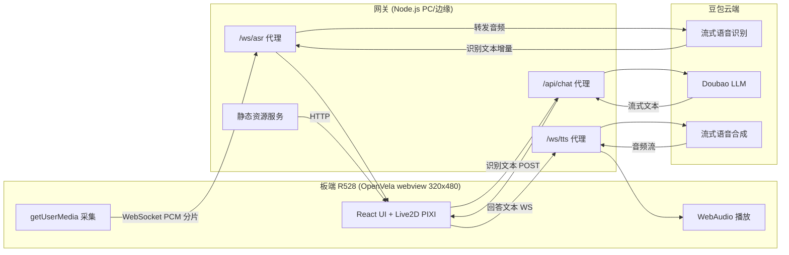
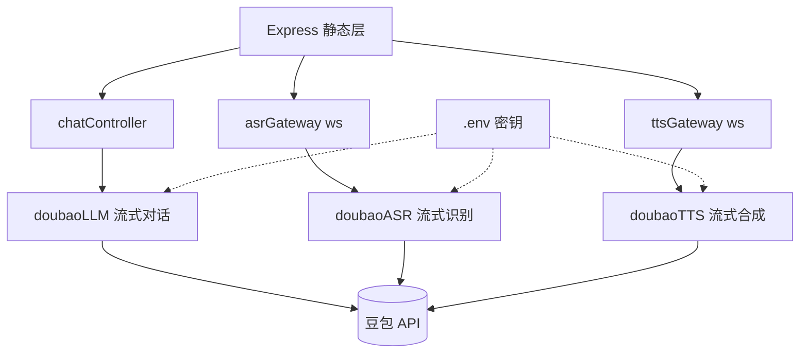

# 技术架构 — R528 Gemini-S1 板端 Live2D 二次元语音对话界面

## 1. 架构设计

三层结构：**板端 webview（前端）** ↔ **网关代理（Node.js）** ↔ **豆包云端**。板端 webview 渲染 Live2D 与采集/播放音频；网关持有豆包密钥并代理 STT/LLM/TTS 流式调用；豆包云端提供大模型能力。板端与网关通过 Wi-Fi（同一局域网）通信。



## 2. 技术说明

- **前端**：React 18 + TypeScript + Vite 5 + Tailwind CSS 3；`pixi.js@7` + `pixi-live2d-display@0.4` + Live2D Cubism Core（`live2dcubismcore.min.js`）；`lucide-react` 图标。
- **初始化工具**：`npm create vite@latest`（react-ts 模板）。
- **网关**：Node.js 18 + Express 4（静态资源 + REST）+ `ws`（WebSocket 流式代理）+ `dotenv`（密钥）。无数据库。
- **豆包接入**：火山引擎方舟 / 豆包大模型平台 HTTP + WebSocket 协议（流式 ASR `bigmodel` 流式接口、Doubao-pro 对话、流式 TTS `bigmodel` 语音合成）。
- **板端**：OpenVela `nsh_minidisplay` 配置 + webview 组件，2.8" SPI 竖屏 320×480，板载 mic 通过 webview `getUserMedia` 暴露（需 webview 支持，烧入前 PC 验证）。
- **数据**：无持久化；对话历史仅存内存（刷新清空），设置项存 `localStorage`。

## 3. 路由定义

### 3.1 前端路由（单页）

| 路由 | 用途 |
|-------|------|
| `/` | 主对话页（Live2D 舞台 + 录音 + 气泡） |

设置抽屉为浮层组件，不单独路由。

### 3.2 网关接口

| 路由 | 方法 | 用途 |
|-------|------|------|
| `/` | GET | 提供前端静态资源（dist/） |
| `/api/chat` | POST | 代理豆包 LLM，SSE 流式返回回答文本 |
| `/ws/asr` | WS | 双向流式：上行 PCM 音频分片，下行识别文本增量 |
| `/ws/tts` | WS | 上行待合成文本，下行流式音频分片（Opus/PCM） |
| `/api/config` | GET | 下发音色/模型等非敏感配置 |

## 4. 接口定义

```typescript
// /api/chat 请求
interface ChatRequest {
  text: string;            // 用户识别后的文本
  history: { role: 'user'|'assistant'; content: string }[]; // 上下文
  persona?: string;        // 人设 system prompt 覆盖
}
// /api/chat 响应（SSE, text/event-stream）
// data: { "delta": "回答增量文本" }
// data: { "done": true }

// /ws/asr
// 上行: { "type":"start"|"chunk"|"end", "audio"?: ArrayBuffer /*16k 16bit PCM*/, "seq"?: number }
// 下行: { "type":"partial"|"final", "text": string }

// /ws/tts
// 上行: { "type":"start", "voice": string, "text": string } | { "type":"end" }
// 下行: { "type":"audio", "seq": number, "audio": ArrayBuffer } | { "type":"end" }

// /api/config 响应
interface ConfigResponse {
  voices: string[];        // 可选音色
  models: string[];        // 可选 LLM
  defaultVoice: string;
  defaultModel: string;
}
```

## 5. 服务架构图



## 6. 数据模型

无数据库。前端内存状态：

```typescript
interface DialogueTurn { id: string; role: 'user'|'assistant'; text: string; ts: number; }
interface AppState {
  phase: 'idle'|'listening'|'recognizing'|'thinking'|'speaking'|'error';
  history: DialogueTurn[];
  partialText: string;     // ASR 实时增量
  answerText: string;      // LLM/TTS 当前回答
  settings: { voice: string; model: string; volume: number; subtitle: boolean; character: 'hiyori'|'haru'; };
}
```

## 7. 关键实现要点

### 7.1 Live2D 集成
- `pixi-live2d-display` 注册到 PIXI；`Application` 初始化为 320×480 透明 Canvas。
- 加载 `Hiyori/Hiyori.model3.json`，启用自动眨眼/呼吸，待机动作组循环。
- 口型同步：`TTS` 播放时 `AnalyserNode.getByteFrequencyData` 取 RMS → 平滑后写入 `model.internalModel.coreModel.setParameterValueById('ParamMouthOpenY', v)`。
- 视线跟随：监听 `pointermove`，映射到 `ParamAngleX/Y`、`ParamEyeBallX/Y`。
- 性能：`antialias:false`、`resolution:1`、`backgroundAlpha:0`；纹理用 1024 版本；锁定 30fps（`ticker.maxFPS=30`）。

### 7.2 音频管线
- 采集：`getUserMedia({audio:{echoCancellation:true,noiseSuppression:true,channelCount:1,sampleRate:16000}})` → `ScriptProcessorNode`/`AudioWorklet` 取 16k PCM 分片 → WS 上行。
- 播放：TTS 音频分片 → `AudioBuffer` 队列 → 顺序 `AudioBufferSourceNode` 播放，同时接 `AnalyserNode` 驱动口型。

### 7.3 豆包网关代理
- 密钥走 `dotenv`，仅网关持有；CORS 仅允许板端来源。
- ASR/TTS 用 `ws` 转发，注意背压与分片序号拼接顺序。
- LLM 用 SSE，带人设 system prompt（二次元少女陪伴语气）。

## 8. 板端烧入与验证（关键，需仔细确认）

> 用户强调「烧入要仔细确认」。烧入分两块：①OpenVela 固件（含 webview）；②Web 资源包。

### 8.1 OpenVela 固件（含 webview 能力）
1. 拉取大赛分支：`open-vela/vendor_allwinnertech@dev-ai-contest-2026` 与 `open-vela/nuttx` 配套分支。
2. 配置：在 `boards/r528/r528s3-gemini-s1/configs/nsh_minidisplay` 基础上，确认开启 webview 组件与 `getUserMedia`/WebGL 支持（menuconfig 中 `CONFIG_WEBVIEW_*`、显示驱动竖屏方向 320×480）。
3. 编译：
   ```
   ./build.sh vendor/allwinnertech/boards/r528/r528s3-gemini-s1/configs/nsh_minidisplay -j8 distclean
   ./build.sh vendor/allwinnertech/boards/r528/r528s3-gemini-s1/configs/nsh_minidisplay -j8
   ```
4. 打包：按板级 `build/` 脚本 `pack` 生成固件镜像。
5. 烧入前**三确认**：①镜像 md5 与编译产物一致；②板上电源/烧录跳线/USB 模式正确；③烧录工具版本与 SoC 匹配。
6. 烧入后验证：串口看到 NSH 启动、`ifconfig` 起 Wi-Fi、webview 进程可拉起、`ls /mnt/web` 有资源。

### 8.2 Web 资源包
1. `npm run build` 产出 `dist/`。
2. 打包：把 `dist/` + `public/live2d/Hiyori/` 资源一起拷入板端文件系统（如 `/mnt/web/`），或由网关 HTTP 提供（首期推荐网关提供，免烧入迭代）。
3. 校验：对每个文件做 md5 列表，烧入后 `md5sum /mnt/web/**` 比对，确保完整。
4. 视觉验证：板端 webview 打开 `file:///mnt/web/index.html` 或 `http://gateway/`，确认 320×480 竖屏满屏无拉伸、Live2D 角色可见、待机动作正常。
5. 链路验证：PC 浏览器先跑通整条对话链路，再切到板端 webview 复测；若板端 webview 无 WebGL，启用静态立绘兜底分支。

## 9. 目录结构

```
rivotek/
├── src/                  # 前端 React
│   ├── components/       # Live2DStage / DialogueBubble / RecordButton / StatusBar / SettingsDrawer
│   ├── hooks/            # useLive2D / useAudioPipeline / useDialogue
│   ├── api/              # wsClient / chatClient
│   ├── App.tsx
│   └── main.tsx
├── public/
│   └── live2d/           # Hiyori 模型资源（model3.json/moc3/纹理/动作）
├── gateway/              # Node 网关
│   ├── server.js         # Express + ws
│   ├── doubao/           # asr.js / llm.js / tts.js
│   └── .env.example
├── scripts/
│   └── pack-web.sh       # 资源打包 + md5 生成
├── index.html
├── vite.config.ts
└── package.json
```
